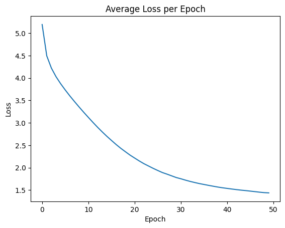

# English-German Neural Machine Translation using Transformer

## Overview

This project implements a Neural Machine Translation (NMT) system for translating English sentences to German using the Transformer architecture.

## Project Structure

- `transformer_model_100k_e50.pth`: The saved model weights - trained on 80k records for 50 epochs
- `notebook.ipynb`: The Jupyter notebook with the code implementation

## Methodology

### 1. Data Preparation

- The Tatoeba dataset contains a large number of sentence pairs in various languages and English-German was used for this project.
- Sentences are filtered to include only English (source language) and German (target language) pairs. This ensures that the model is trained specifically for English-German translation.
- A vocabulary is built for both source and target languages. The vocabulary consists of the most frequent words in the dataset, along with special tokens like `<pad>` (padding), `<unk>` (unknown), `<sos>` (start of sequence), and `<eos>` (end of sequence).
- Sentences are numericalized using the vocabulary mappings. Each word in a sentence is replaced with its corresponding index in the vocabulary. This converts the text data into a numerical format that can be processed by the model.

### 2. Model Architecture

- The core of the model is the Transformer architecture, composed of:
  - **Encoder:** Processes the input English sentence by embedding each word into a vector representation and passing it through multiple layers of self-attention and feed-forward networks to understand the meaning and context of the input sentence
  - **Decoder:** Generates the translated German sentence step-by-step, using attention mechanisms to focus on relevant parts of the encoded input and its own previously generated words
  - **Multi-Head Attention:** Allows the model to attend to different parts of the input sequence simultaneously, like having multiple spotlights that can focus on different words or phrases in the sentence, helping the model capture complex relationships between words
  - **Position-Wise Feed-Forward Networks:** Introduce non-linearity and enhance the model's expressive power by applying a sequence of transformations to the output of the attention layers - helping the model learn more intricate patterns in the data
  - **Positional Encoding:** Encodes the position of words in the sequence, providing the model with information about the word order. Since the Transformer doesn't process words sequentially like RNNs, positional encoding is essential for capturing the sequential nature of language.

### 3. Training

- The model is trained using a cross-entropy loss function. This function measures the difference between the predicted probability distribution over the target vocabulary and the actual target word.
- The Adam optimizer is used to update the model's parameters during training. Adam is an adaptive optimization algorithm that adjusts the learning rate for each parameter individually, leading to faster and more stable convergence.
- Training is performed on 500k records (training set) for 75 epochs.
- **The following graph illustrates the training loss over epochs, demonstrating the model's convergence:**

  

- The decreasing trend in the loss curve indicates that the model effectively learned from the training data and improved its performance over time.

### 4. Evaluation

- The model is evaluated on a held-out test set of 20k records, which was not used during training, allowing us to assess the model's ability to generalize to unseen data.
- BLEU (Bilingual Evaluation Understudy) score: It is Precision-based method that compares the generated translations to reference translations and calculates a score based on the overlap of n-grams (sequences of words). A higher BLEU score indicates better translation quality.

## Important Concepts in Transformer Architecture

- **Attention Mechanism:** Allows the model to focus on relevant parts of the input sequence when generating the output. Multi-head attention mechanism helps the model capture long-range dependencies and understand the context of each word more effectively
- **Self-Attention:** Allows the model to attend to different positions within the same input sequence. It helps the model understand the relationships between different words in a sentence
- **Cross-Attention:** Enables the decoder to attend to the encoder output, facilitating information flow between the source and target languages. This allows the decoder to leverage the information extracted by the encoder to generate more accurate translations
- **Encoder-Decoder Structure:** The fundamental framework for Seq2Seq models, where the encoder processes the input and the decoder generates the output

## Difficulties Faced and Solutions

- **Model Complexity:** Fine-tuning, such as the number of layers, heads, and hidden units, to improve model performance
- **Computational Resources:** Used Google Colab to train the model

## Results

- The trained model achieves a BLEU score of **0.33** on the test set.
- Qualitative analysis of the translations shows promising results in terms of fluency and accuracy.
